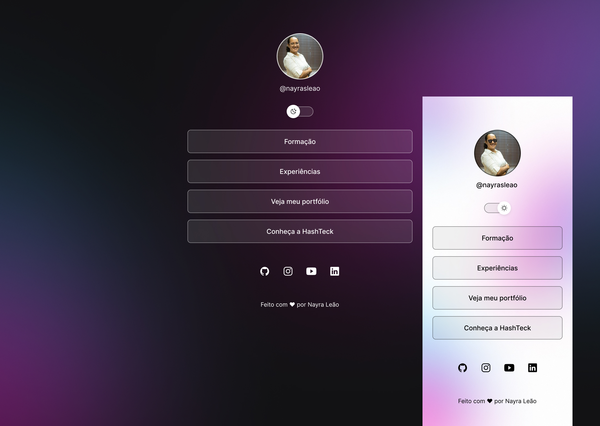

<h1 align="center"> Página Pessoal com Links </h1>

Página Pessoal - Portfólio  

  <a href="#-tecnologias">Tecnologias</a>&nbsp;&nbsp;&nbsp;|&nbsp;&nbsp;&nbsp;
  <a href="#-projeto">Projeto</a>&nbsp;&nbsp;&nbsp;|&nbsp;&nbsp;&nbsp;
  <a href="#-layout">Layout</a>&nbsp;&nbsp;&nbsp;|&nbsp;&nbsp;&nbsp;
  <a href="#memo-licença">Licença</a>

  

 

  

## 🚀 Tecnologias

Esse projeto foi desenvolvido com as seguintes tecnologias:

- HTML e CSS
- JavaScript
- Gulp
- Git e Github
- Figma

## 💻 Projeto

O Portfólio inicia com um agregador de links que leva o usuário para conteúdos especificos sobre mim.

- [Acesse o projeto que está em construção](https://nayrasleao.vercel.app/)

## 🔖 Layout

Você pode visualizar o layout do projeto através [DESSE LINK](https://www.figma.com/file/sSrWS2Wtok10G3vryWjDgy/Portf%C3%B3lio-%E2%80%A2-Nayra-Le%C3%A3o?type=design&node-id=58%3A415&mode=design&t=TN635lDnKwyqaBXP-1). É necessário ter conta no [Figma](https://figma.com) para acessá-lo.

## :memo: Licença

Esse projeto está sob a licença MIT.
